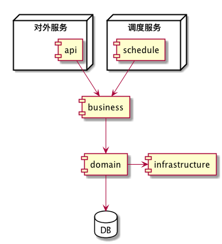

# xxxx项目框架

## 模块划分

采用模块划分思想组建项目，每一层都具有一个专有的职责，便于分层测试与复用。

- `infrastructure`
- `domain`
- `business`
- `api`
---- 根据需要添加**调度任务模块**
- `schedule`
具体的构建关系如下：

#### infrastructure模块

- 提供报文加解密入口`CryptoMessageConverter`
- 定义报文基本契约类`ResponseVO`、`RequestVO`、`PageParam`
- 提供统一异常处理机制`GlobalExceptionHandler`
- 集成mybatis的spring配置
- 提供`BasicMapper`
- 分页支持

此模块是整个项目基础框架的具体实现，依赖springboot、mybatis、pagehelper、mapper等开源框架

####  domain模块

持久化，采用Mybatis解决，依赖于`infrastructure`

- 定义实体类
- 编写mapper类
- 编写mapper配置文件

此模块除`mapper配置文件`外，未编写数据库操作相关的具体实现，主要依赖于`infrastructure`

#### business模块

业务逻辑模块，依赖于`domain`

业务逻辑的处理集中在此层处理

#### api模块

提供所有对外服务的模块

- 集成swagger接口文档
- 集成请求报文参数校验